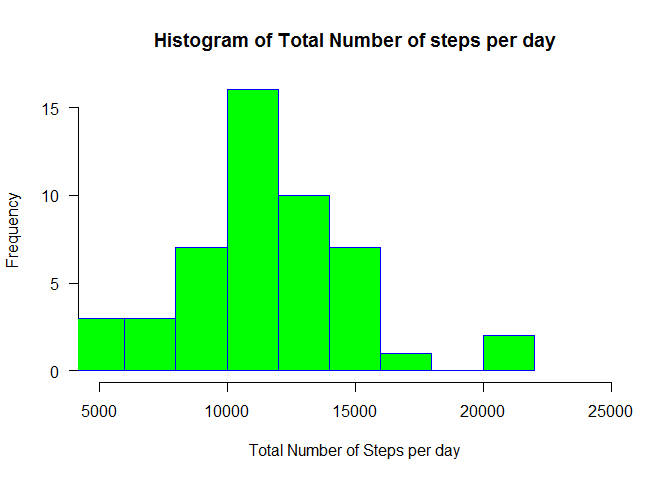
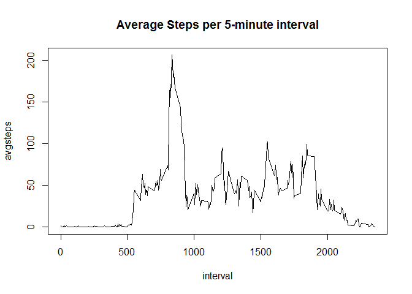
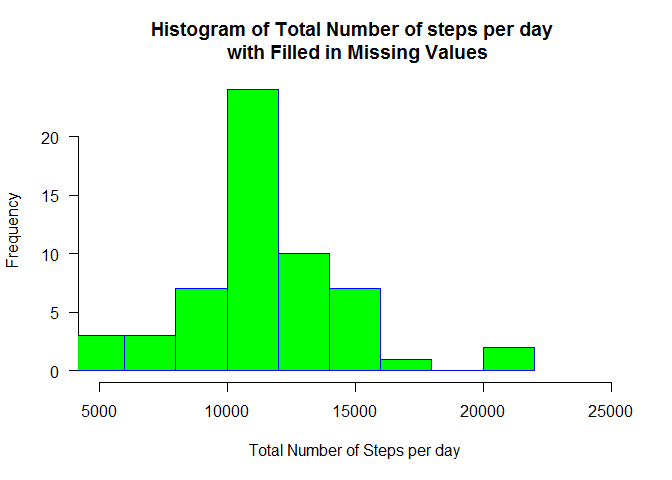
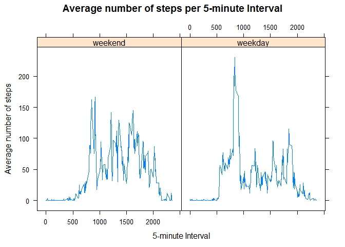

# Reproducible Research: Peer Assessment 1


## Loading and preprocessing the data
### (1) - Load data

```r
activity <- read.csv(unzip("activity.zip"), head=TRUE,sep=",")
```
### (2) - Check the data frame and transform date

```r
str(activity)
```

```
## 'data.frame':	17568 obs. of  3 variables:
##  $ steps   : int  NA NA NA NA NA NA NA NA NA NA ...
##  $ date    : Factor w/ 61 levels "2012-10-01","2012-10-02",..: 1 1 1 1 1 1 1 1 1 1 ...
##  $ interval: int  0 5 10 15 20 25 30 35 40 45 ...
```

```r
activity$date <- as.Date(activity$date)
```

## What is mean total number of steps taken per day?
### (1) - Histogram

```r
agdata <- aggregate(activity$steps, by=list(date=activity$date), FUN=sum)
hist(agdata$x, main="Histogram of Total Number of steps per day",
    xlab="Total Number of Steps per day",
    ylab="Frequency",
    border="blue", 
    col="green",
    xlim=c(5000,25000),
    las=1, 
    breaks=10
)
```

<!-- -->

### (2) - Mean and Median number of steps per day

```r
library(plyr)
```

```
## Warning: package 'plyr' was built under R version 3.2.3
```

```r
avgdata <- ddply(activity, .(date), summarise,
               "Mean" = mean(steps),
               "Median" = median(steps)
)
print(avgdata)
```

```
##          date       Mean Median
## 1  2012-10-01         NA     NA
## 2  2012-10-02  0.4375000      0
## 3  2012-10-03 39.4166667      0
## 4  2012-10-04 42.0694444      0
## 5  2012-10-05 46.1597222      0
## 6  2012-10-06 53.5416667      0
## 7  2012-10-07 38.2465278      0
## 8  2012-10-08         NA     NA
## 9  2012-10-09 44.4826389      0
## 10 2012-10-10 34.3750000      0
## 11 2012-10-11 35.7777778      0
## 12 2012-10-12 60.3541667      0
## 13 2012-10-13 43.1458333      0
## 14 2012-10-14 52.4236111      0
## 15 2012-10-15 35.2048611      0
## 16 2012-10-16 52.3750000      0
## 17 2012-10-17 46.7083333      0
## 18 2012-10-18 34.9166667      0
## 19 2012-10-19 41.0729167      0
## 20 2012-10-20 36.0937500      0
## 21 2012-10-21 30.6284722      0
## 22 2012-10-22 46.7361111      0
## 23 2012-10-23 30.9652778      0
## 24 2012-10-24 29.0104167      0
## 25 2012-10-25  8.6527778      0
## 26 2012-10-26 23.5347222      0
## 27 2012-10-27 35.1354167      0
## 28 2012-10-28 39.7847222      0
## 29 2012-10-29 17.4236111      0
## 30 2012-10-30 34.0937500      0
## 31 2012-10-31 53.5208333      0
## 32 2012-11-01         NA     NA
## 33 2012-11-02 36.8055556      0
## 34 2012-11-03 36.7048611      0
## 35 2012-11-04         NA     NA
## 36 2012-11-05 36.2465278      0
## 37 2012-11-06 28.9375000      0
## 38 2012-11-07 44.7326389      0
## 39 2012-11-08 11.1770833      0
## 40 2012-11-09         NA     NA
## 41 2012-11-10         NA     NA
## 42 2012-11-11 43.7777778      0
## 43 2012-11-12 37.3784722      0
## 44 2012-11-13 25.4722222      0
## 45 2012-11-14         NA     NA
## 46 2012-11-15  0.1423611      0
## 47 2012-11-16 18.8923611      0
## 48 2012-11-17 49.7881944      0
## 49 2012-11-18 52.4652778      0
## 50 2012-11-19 30.6979167      0
## 51 2012-11-20 15.5277778      0
## 52 2012-11-21 44.3993056      0
## 53 2012-11-22 70.9270833      0
## 54 2012-11-23 73.5902778      0
## 55 2012-11-24 50.2708333      0
## 56 2012-11-25 41.0902778      0
## 57 2012-11-26 38.7569444      0
## 58 2012-11-27 47.3819444      0
## 59 2012-11-28 35.3576389      0
## 60 2012-11-29 24.4687500      0
## 61 2012-11-30         NA     NA
```

## What is the average daily activity pattern?
### (1) - Time series plot

```r
actintv <- aggregate(activity$steps, by=list(interval=activity$interval), FUN=mean, na.rm=TRUE)
colnames(actintv) <- c('interval', 'avgsteps')
with(actintv, plot(interval, avgsteps, type="l", main="Average Steps per 5-minute interval"))
```

<!-- -->

### (2) - 5-minute interval with max number of steps

```r
actintv[actintv$avgsteps == max(actintv$avgsteps),]$interval
```

```
## [1] 835
```

## Imputing missing values

### (1) - Total number of rows containing missing values

```r
nrow(activity[is.na(activity),])
```

```
## [1] 2304
```
### checking which columns actually contain missing values (nrow > 0)

```r
nrow(activity[is.na(activity$steps),])
```

```
## [1] 2304
```

```r
nrow(activity[is.na(activity$date),])
```

```
## [1] 0
```

```r
nrow(activity[is.na(activity$interval),])
```

```
## [1] 0
```
### (2) - Strategy for Filling in Missing values
#### We'll use the average steps per interval accross all days
####  Average values per interval come from previously created data frame (actintv)
### (3) - data frame with filled in mising values

```r
activit2 <- activity
for (i in 1:nrow(activit2)) {
    if (is.na(activit2[i,]$steps)){
        savintv = activit2[i,]$interval
        activit2[i,]$steps = actintv[actintv$interval == savintv,]$avgsteps
    }   
}
```
### (4) Aggregate the filled in data frame and make a Histogram

```r
agdat2 <- aggregate(activit2$steps, by=list(date=activit2$date), FUN=sum)

hist(agdat2$x, 
     main="Histogram of Total Number of steps per day \n with Filled in Missing Values",
     xlab="Total Number of Steps per day",
     ylab="Frequency",
     border="blue", 
     col="green",
     xlim=c(5000,25000),
     las=1, 
     breaks=10
)
```

<!-- -->

#### - Mean and Median number of steps per day

```r
avgact2 <- ddply(activit2, .(date), summarise,
               "Mean" = mean(steps),
               "Median" = median(steps)
)
print(avgact2)
```

```
##          date       Mean   Median
## 1  2012-10-01 37.3825996 34.11321
## 2  2012-10-02  0.4375000  0.00000
## 3  2012-10-03 39.4166667  0.00000
## 4  2012-10-04 42.0694444  0.00000
## 5  2012-10-05 46.1597222  0.00000
## 6  2012-10-06 53.5416667  0.00000
## 7  2012-10-07 38.2465278  0.00000
## 8  2012-10-08 37.3825996 34.11321
## 9  2012-10-09 44.4826389  0.00000
## 10 2012-10-10 34.3750000  0.00000
## 11 2012-10-11 35.7777778  0.00000
## 12 2012-10-12 60.3541667  0.00000
## 13 2012-10-13 43.1458333  0.00000
## 14 2012-10-14 52.4236111  0.00000
## 15 2012-10-15 35.2048611  0.00000
## 16 2012-10-16 52.3750000  0.00000
## 17 2012-10-17 46.7083333  0.00000
## 18 2012-10-18 34.9166667  0.00000
## 19 2012-10-19 41.0729167  0.00000
## 20 2012-10-20 36.0937500  0.00000
## 21 2012-10-21 30.6284722  0.00000
## 22 2012-10-22 46.7361111  0.00000
## 23 2012-10-23 30.9652778  0.00000
## 24 2012-10-24 29.0104167  0.00000
## 25 2012-10-25  8.6527778  0.00000
## 26 2012-10-26 23.5347222  0.00000
## 27 2012-10-27 35.1354167  0.00000
## 28 2012-10-28 39.7847222  0.00000
## 29 2012-10-29 17.4236111  0.00000
## 30 2012-10-30 34.0937500  0.00000
## 31 2012-10-31 53.5208333  0.00000
## 32 2012-11-01 37.3825996 34.11321
## 33 2012-11-02 36.8055556  0.00000
## 34 2012-11-03 36.7048611  0.00000
## 35 2012-11-04 37.3825996 34.11321
## 36 2012-11-05 36.2465278  0.00000
## 37 2012-11-06 28.9375000  0.00000
## 38 2012-11-07 44.7326389  0.00000
## 39 2012-11-08 11.1770833  0.00000
## 40 2012-11-09 37.3825996 34.11321
## 41 2012-11-10 37.3825996 34.11321
## 42 2012-11-11 43.7777778  0.00000
## 43 2012-11-12 37.3784722  0.00000
## 44 2012-11-13 25.4722222  0.00000
## 45 2012-11-14 37.3825996 34.11321
## 46 2012-11-15  0.1423611  0.00000
## 47 2012-11-16 18.8923611  0.00000
## 48 2012-11-17 49.7881944  0.00000
## 49 2012-11-18 52.4652778  0.00000
## 50 2012-11-19 30.6979167  0.00000
## 51 2012-11-20 15.5277778  0.00000
## 52 2012-11-21 44.3993056  0.00000
## 53 2012-11-22 70.9270833  0.00000
## 54 2012-11-23 73.5902778  0.00000
## 55 2012-11-24 50.2708333  0.00000
## 56 2012-11-25 41.0902778  0.00000
## 57 2012-11-26 38.7569444  0.00000
## 58 2012-11-27 47.3819444  0.00000
## 59 2012-11-28 35.3576389  0.00000
## 60 2012-11-29 24.4687500  0.00000
## 61 2012-11-30 37.3825996 34.11321
```
#### Now comparing summarized data of NA filled IN and Not

```r
all.equal(avgdata,avgact2)
```

```
## [1] "Component \"Mean\": 'is.NA' value mismatch: 0 in current 8 in target"  
## [2] "Component \"Median\": 'is.NA' value mismatch: 0 in current 8 in target"
```

```r
colMeans(avgdata[, c(2,3)], na.rm=TRUE)
```

```
##    Mean  Median 
## 37.3826  0.0000
```

```r
colMeans(avgact2[, c(2,3)])
```

```
##      Mean    Median 
## 37.382600  4.473863
```
#### Per the result above the means did not change but the median did  


## Are there differences in activity patterns between weekdays and weekends?
### (1) - New `factor` variable with 2 levels "weekday"" and "weekend"  
#### create a vector and convert to `factor` specifying `levels/labels`
#### First, create a vector of weekdays

```r
activit2$date <- as.Date(activit2$date)
weekdays1 <- c('Monday', 'Tuesday', 'Wednesday', 'Thursday', 'Friday')
activit2$wDay <- factor((weekdays(activit2$date) %in% weekdays1), 
                   levels=c(FALSE, TRUE), labels=c('weekend', 'weekday') 
                 )
```
### (2) Panel plot
#### summarize by interval and weekday factor

```r
avgdat2 <- ddply(activit2, .(interval, wDay), summarise,
                 "AvgSteps" = mean(steps)
            )
```
#### Time series plot

```r
library(lattice)
xyplot(AvgSteps ~ interval | wDay, data=avgdat2,
       main = "Average number of steps per 5-minute Interval",
       xlab = "5-minute Interval", 
       ylab = "Average number of steps",
       type = c("l"), layout = c(2, 1)
)
```

<!-- -->
